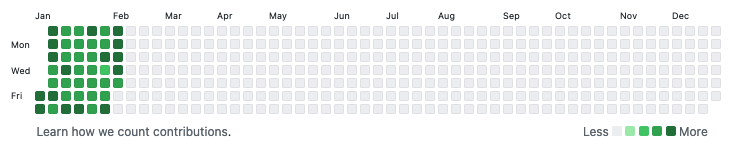

I have led Leeds Data Science Society to [win a national championship]((https://www.hiscoxgroup.com/blog/hiscox/leeds-crowned-winners-hiscox-university-challenge) ) and finalist in Hiscox's insurance data science competitions for two years. Also I have lead my team to reach top 3 in Npower's energy forecasting competition as well as [trivago's hotel data science competition](http://bit.ly/2BwC2Wd). Now I work on bespoke data science projects across the NHS, Department of Education, local authorities and universities in Yorkshire. In addition, I have been a Principle Investigator in data science projects at [Leeds Institute of Data Analytics](https://lida.leeds.ac.uk/) and a dissertation supervisor in MSc Business Analytics at the [Leeds University Business School](https://business.leeds.ac.uk). 

### GitHub contribution (2021): 

