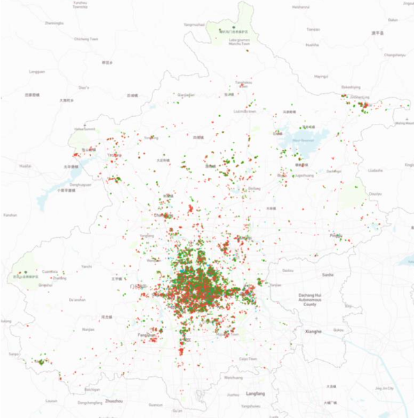

With the development of sharing economy, Airbnb has become an attractive choice for both travelers and property owners, especially in big cities like Beijing. The majority of hosts in Airbnb are not professional and thus have little knowledge on how to set reasonable rental prices. This study mainly focuses on two questions: which features are important to listings price and what pricing models are suitable for Beijing Airbnb? The author employed linear regression model to select features and machining learning techniques to do price prediction, which bridges some research gaps. The results show that property attributes and review data are key determinants for Beijing Airbnb price and random forest performs best in terms of price prediction. These findings will help stakeholders, such as platform managers and hosts, to get a better understanding of their market strategies and to build rational pricing strategies.