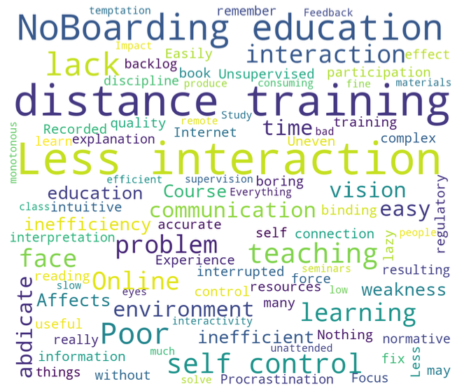

E-learning is rapidly evolving and is affecting all walks of life. Especially this year, because of Coronavirus, the number of users using e-learning is growing rapidly. Because of Coronavirus, schools have stopped physical classes and forced all students to study online. In the survey, students will be asked about their perceptions of e-learning from a variety of viewpoints, such as length of study, educational impact, comparison to traditional classes, enjoyment, impact of campus experience, impact of diplomas, motivation, and privacy. As a result of this study, it was found that the age of the learner was positively correlated with self- control; academic background was more focused on the impact of e-learning on the value of clerical employment; and the quality of teaching and educational resources influenced the value of e-learning. The study will identify key factors for the future direction of e-learning development.