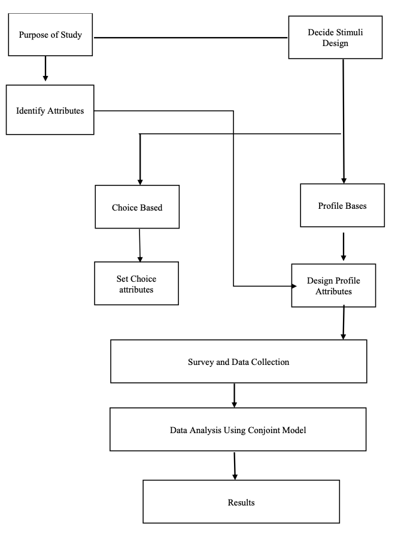

The concept of housing preference has been studied for decades in multiple discipline and previous extensive research show how housing preferences have some uniqueness and similarities in across different group of people and culture. Arguably, choices and preferences in society can be considered as a constant dynamic phenomenon and with student housing being highlighted as an important body of knowledge in housing studies it is safe to say that, this area of research needs more investigations due to constant behaviour dynamism of students in each generation. There are substantial factors which influence students to choose their accommodation arrangement from any given pool of alternative. This study aims to examine and understand students’ decisions making process when choosing their residence and how different factors affect their decision-making process and how they influence students’ housing arrangement satisfaction. To gain insight on the research objective, an online survey was designed and by using social media 200 respondents were reached. 51% of the respondents were male and 49% were female with age distribution of; 5% between the age of 18 to 20 years, 14% between the age of 20-22 years, 25% between the age of 22-24 years and the rest were above 24 years old. Other factors which were taken into consideration were the level of study, among the respondents 36% were studying master’s degree, 46% were undergraduates and the rest were a mix of PhD students and other short-term programs (e.g. language) students. The study results show how significant factors were considered to understand students housing decisions. By considering factors like age, gender, proximity to public facilities, city centres, transportation etc. initial data analysis revealed a positive correlation between gender and living on or off-campus, and a correlation between gender and living in q facility with or without a private bathroom. More factors were analysed and obtained results which show students housing satisfaction level is affected by several factors. The study infers that, merely providing accommodation facility does not ensure students satisfaction with their living condition. Moreover, the study shows that satisfaction predictors should not be generalized since among other factors gender, age and academic level seemed to play key roles in students housing decision making process.
