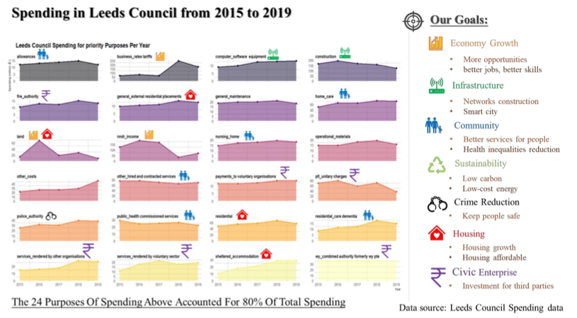

Currently, with the increasing development of open data as well as public’s awareness of performance evaluation for local governments to see whether governments are doing their jobs. In this way, local governments have to satisfy the increasing needs from the public and make full use of the open data. Thus, this paper is aiming to provide a way for local governments to use open government data to develop open data driven KPI to evaluate their performance and use visualization to monitor their performance and facilitate participations of the public. Based on this, the spending data of Leeds Council is used to mine the possible patterns within the data through cluster analysis and dashboard is used to manage the performance in the visual way. In this case, spending is defined as the open KPI to evaluate the performance of Leeds Council and it is found that there are priorities of spending which can be compared with operational goals to determine whether Leeds government has good performance. Finally, it is suggested that not only local governments but also business corporations can utilize the open data to create more values and support their decisions making.