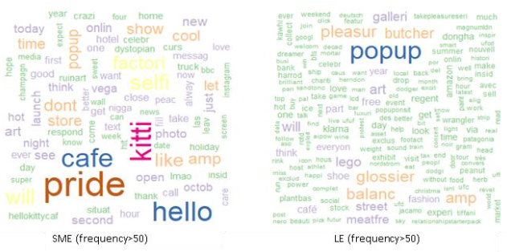
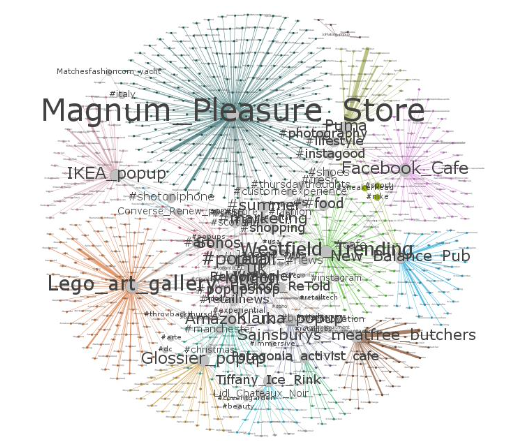

The goal is to compare the online sentiment, social media topics, and network tie of pop-up stores from SME (small and medium- sized enterprises) and LE (large enterprise) in the UK. This project is focused on sentiment analysis, topic modelling and network analysis on the social media data associated with the pop-up stores. Three findings have been derived from the study. First of all, neutral is the most common attitude for the pop-up stores, and the public has the less negative attitudes towards the pop-up stores of LE compared to the pop-up stores of SME. Specifically, the public tends to feel more positive and anticipated with the pop-up stores of LE, but more joy with the pop-up stores of SME. What is more, the synergy exists when one pop-up store launched, which would boost the public attitude to other pop-up stores. Second, there is no difference in terms of the social media text topics involved with the pop-up stores between the LE and SME, which would conclude into three topics, subjects of pop-up stores, time and location, and attractive words. Third, LEs are more willing to not only use the easily recognizable hashtags but also collaborative with accounts of social media influencer and other businesses than the SMEs.
