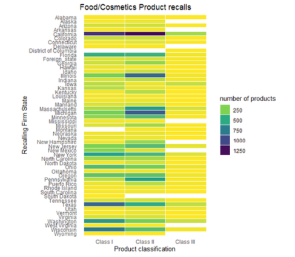

Food recall is an effective way to ensure food safety. However, it may have adverse financial impact on companies. Here, we analyzed the recalls of food and cosmetics products, recorded by U.S. Food and Drug Administration for fiscal year 2013 through 2019 (i.e. 1 October 2012 to 30 September 2019). This study suggests that microbial contamination and undeclared allergens were still the leading causes of the food and cosmetics recalls during the study period. Listeria monocytogenes and Salmonella were the main pathogens related with microbial contamination. Milk were the most common allergen that failed to be declared. This study also introduced a new method to classify the recall reasons which paved the way for future study.