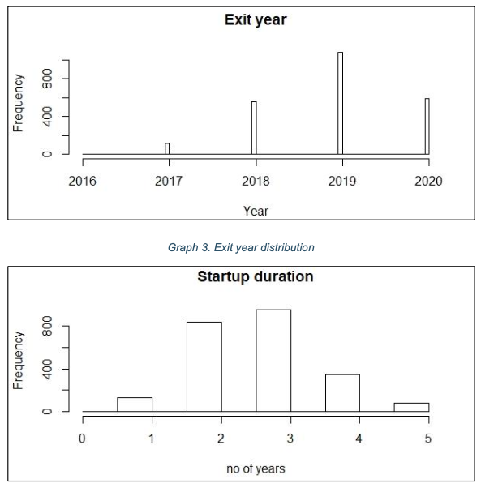

This project studies the survival factors of technological startups registred in London between 2015 and 2019. It also develops a Random Forest model to predict future startup status (Active or Out of business). The analysis uses the combination of two data sources, FAME and Companies House. This work shows that the survival of technology startups is positively linked to directors age, company size (“liability of smallness” thesis) and the indebtedness level (“Pecking order” theory). The analysis also finds a positive relationship between female directors presence and survival rate, which contradict a large number of articles. The startup geographic location is also analysed, a however more detailed study should be done to identify how it is connected with the business performance. Finally, the predictive model developed offers an acceptable accuracy (around 0.7) but a moderate agreement with the actual values (Kappa = 0.44).